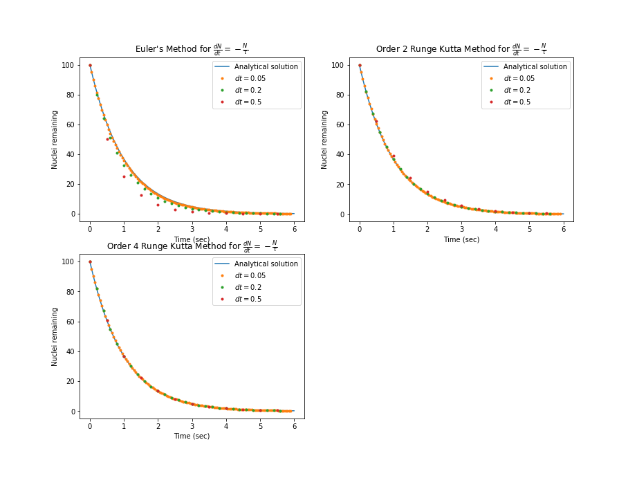
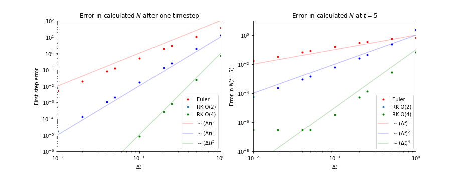

# ODE_solvers_in_C
This is a C implementation of Euler's Method, the order 2 Runge-Kutta method, and the order 4 Runge-Kutta method for solving ordinary differential equations (ODEs). 
Each of the ODE solvers is capable of solving single ODEs, as well as systems of 2 or 4 ODEs. A sample application to a simple model of radioactive decay is included.

These ODE solvers were created as part of assignment 3 for the PHYSICS 352-0: Introduction to Computational Physics at Northwestern University, taught in Winter 2021 by Sasha Tchekhovskoy. Professor Tchekhovskoy's lecture videos can be found on YouTube [here](https://youtu.be/q1vPVQ9g23I). 

## The ODE solvers
Source code for the Euler's Method, order 2 Runge-Kutta method, and the order 4 Runge-Kutta method are in the `ode` directory.

To build the ODE library, run `buildODElib.sh` in your shell. This generates `ode/lib/libODE.a`, an archive library file.

## Sample exponential decay application
To run the sample radioactive decay application, run `decay.sh` in your shell. This creates an executable `decay.exe` and runs it. Each of the three ODE solvers solves the ODE

$$
\frac{dN}{dt} = - \frac{N}{\tau}
$$

using various time steps, and data is recorded in `csv` format in the `decay_data` directory. (The time steps used can be adjusted by modifying a list in `decay.sh`.)

A Jupyter notebook has been included to plot the decay data solved by the three ODE solvers. As expected, the Runge-Kutta order 4 method has the least error: 

The error is also explicity plotted in the Jupyter notebook: 
